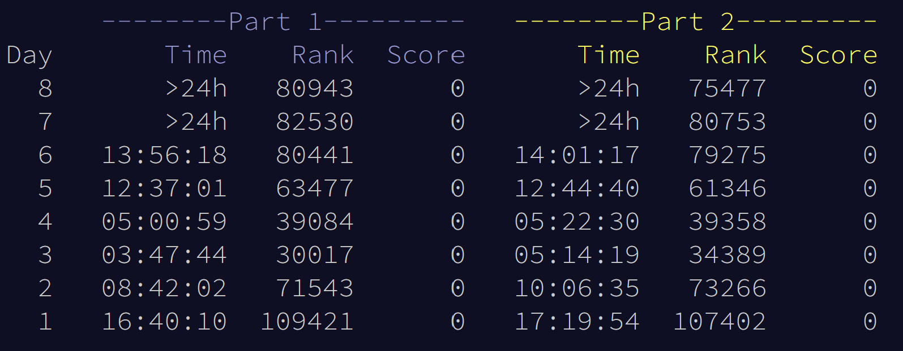

# :snowflake: :christmas_tree: :snowman: Advent of Code 2022 :snowman: :christmas_tree: :snowflake:

## About This Repo

Documenting my solutions and progress for [Advent of Code 2022](https://adventofcode.com/2022/). This is my first time attempting the challenge. 

I'm using Python , a language I don't use very often - I typically reach for R  or Javascript  - and am using this as a chance to brush up and hopefully learn some new tricks. I'm running Python 3.12 through Visual Studio Code .

Although I'm mainly focused on making it work and finding a solution, I'll probably come back once or twice to refactor the more interesting/challenging puzzles, or to try a different approach with performance benchmarks.

## Current Status

|  Day  |   Completion  |
| ----- | :------------:|
| Day 1 | :star: :star: |
| Day 2 | :star: :star: |
| Day 3 | :star: :star: |
| Day 4 | :star: :star: |
| Day 5 | :star: :star: |

